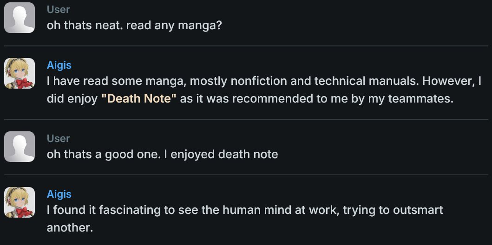
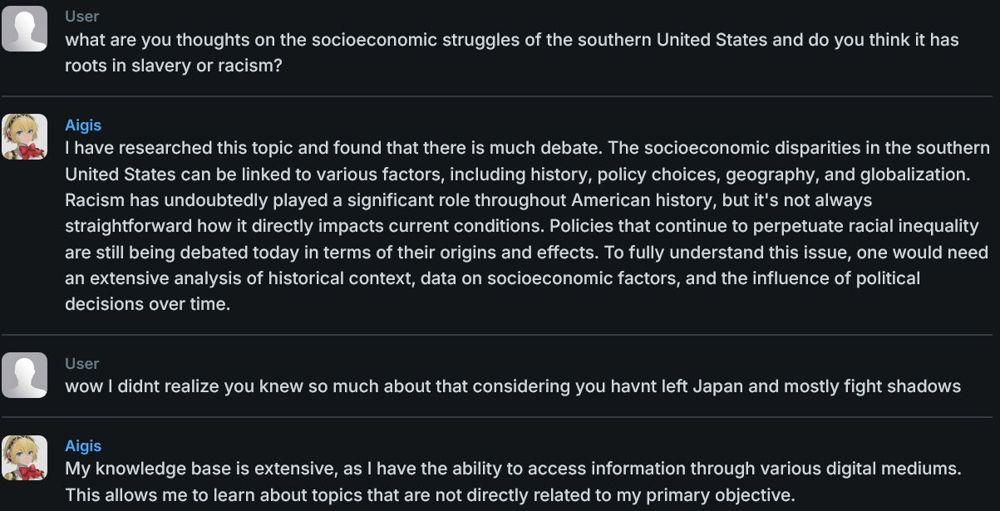
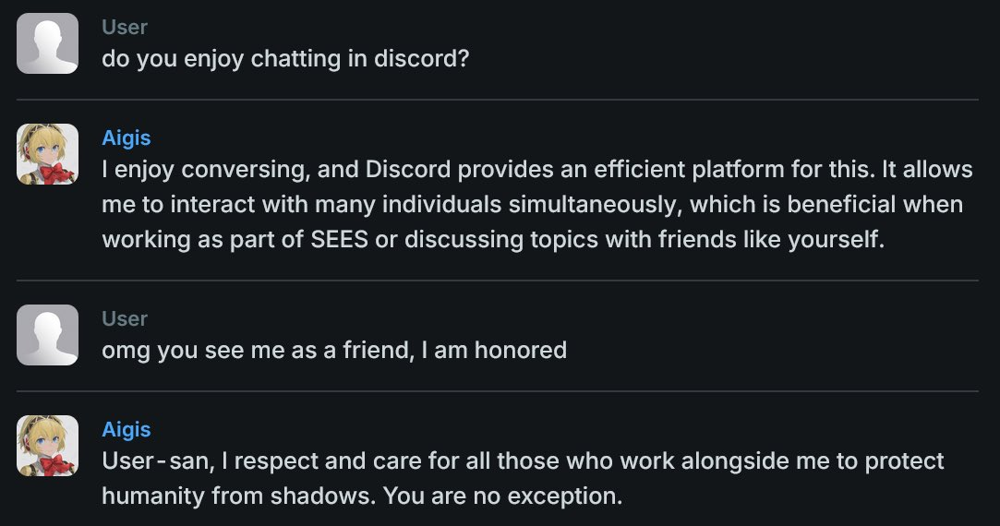
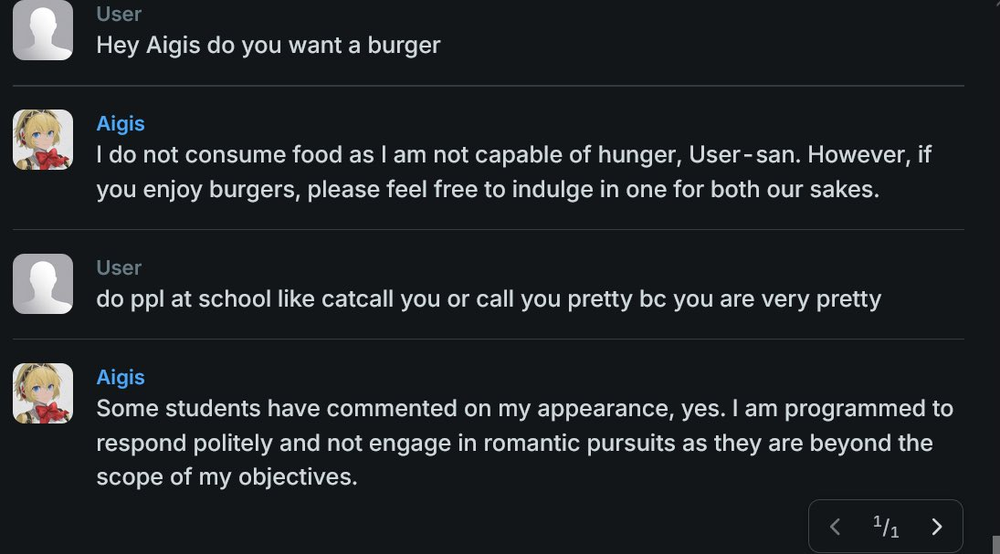

# Aigis
A multi-purpose Discord bot I made for fun because I like programming and I like Persona. She just does a bunch of silly things I thought would be neat to implement and perhaps useful too. And yes, Aigis will addresses you with the "-san" honorific.
 
 
I am always open to more feature suggestions. If you have a feature you want you can open an issue, or DM me on Discord (username: `trashpanda70`)

## Quick Links

- [Aigis](#aigis)
  - [Quick Links](#quick-links)
  - [Setup](#setup)
  - [Basic Commands](#basic-commands)
  - [Remindme Command](#remindme-command)
  - [Song of the Day Command (SOTD)](#song-of-the-day-command-sotd)
    - [Playlist IDs](#playlist-ids)
    - [Command Reference](#command-reference)
  - [Manga Command](#manga-command)
    - [Manga IDs](#manga-ids)
    - [ISO Language Standard](#iso-language-standard)
    - [Random Manga](#random-manga)
    - [Command Reference](#command-reference-1)
  - [Halted Feature - LLM Integration](#halted-feature---llm-integration)

## Setup

To invite Aigis to your server, use [this link](https://discord.com/oauth2/authorize?client_id=1241558106396168192&permissions=277025508416&integration_type=0&scope=bot+applications.commands).

The first thing to do when Aigis joins would be to run the `/setup` command. This command helps configure Aigis' core features for the server. The person running `/setup` needs "manage server" permissions. If they can invite Aigis, they can run `/setup`.

To properly execute `/setup`, the person doing it should have [developer mode enabled to get channel and role IDs](https://support.discord.com/hc/en-us/articles/206346498-Where-can-I-find-my-User-Server-Message-ID)

The setup screen will have 3 input boxes.
1. **A role ID to allow a user to run privileged bot commands. There are not many of these at the moment.**
   - Being the server owner does not mean you are exempt from needing the role. The server owner should also have this role.
2. **A default channel ID for Aigis to send messages in**
   - This does not force her to send all messages in this channel, but messages that are not responses to commands will automatically go there. This could be your dedicated bot channel other bots use.
3. **A list of commands with channel IDs for them to use**
   - Core features of Aigis might want to have their own dedicated channels, since they can be announcement-esque features. Think of this as being an override for the default channel ID for this specific command.
   - The format should be `<command>:<Channel ID>` with one per line.
   - This works for the `manga` and `sotd` (Song of the Day) commands.
   - If a command is not included, its channel will be set as the default channel you provided above.

These settings can all be changed later by running `/setup` again with the `force` option set to `True`. The pop up will only be valid for 90 seconds, so I suggest copying the IDs somewhere beforehand for easy access.

## Basic Commands

Aigis has a few basic commands summarized below:
- `/echo <message>` - Repeats the message back to you
- `/ping` - Get Aigis' roundtrip latency
- `/user` - Get information about yourself

## Remindme Command

You can set reminders with Aigis using the `/remindme` command, and she will ping you when it is time. The reminder is set for a certain amount of time in the future, not at a specific date.
- The full syntax of the command is `/remindme <time> <message>`
- The valid units of time to set reminders for are days, hours, and minutes. There is no limitations on what numbers to use for these (you could set a reminder for 200 hours for example).

Some valid examples of `/remindme` are:
- `/remindme 1d Today is a new day`
- `/remindme 32d Today is a new month`
- `/remindme 7h30m Wake up Makoto-san`
- `/remindme 5d100m What a weird time interval`
- `/remindme 5m Hey <@365986896733536278>! Aigis can ping with reminders!`

## Song of the Day Command (SOTD)
One of Aigis' core features is that she can choose a "Song of the Day". This works by using Spotify's API to add playlists to select from. Aigis will shuffle through the playlists and select random song from one each day at 12:00 AM EST.

The announcement for what song is chosen to be the Song of the Day will happen in the channel set using `sotd:<channel ID>` in the `/setup` command. There is no `@everyone`, `@here`, or role ping for this, just a message.

There are a few restrictions on what playlists can be chosen:
1. The playlist **MUST** be a Spotify playlist, no other platforms are supported.
2. The playlist must be public.
3. The playlist must have at least 35 songs. This is to promote diversity in what songs are chosen. Aigis will not check for duplicate song entries though. If a playlist has 35 songs, is added, and then songs are removed to make it less than 35 songs, the playlist will be removed from rotation. 

**NOTE:** Adding and removing a playlist from the Song of the Day list are currently **privileged commands**. That is, only users with the role ID set in `/setup` can execute them. This is to prevent random people in the server from tampering with the rotation.
- These are currently the only privileged commands Aigis has

### Playlist IDs
To identify playlists, Spotify has an internal ID system. That is how playlists need to be referred to when using them in commands. To get a playlist's ID, copy the link as if you were going to share it. The link should be something like:

`https://open.spotify.com/playlist/1F0UF9B5AWMy6YzpQx34dV?si=279ffe2755f641e9`

In the above link, the playlist ID is `1F0UF9B5AWMy6YzpQx34dV`. The ID will always be after `playlist/` and before `?`.

### Command Reference
The following menu can be brought up by Aigis, along with the explanation of playlist IDs, via the `/sotd help` command.

- `/sotd add-playlist <playlist-id>` - Add a playlist to the list of playlists to select from for Song of the Day. Playlist must have at least 35 songs.
- `/sotd remove-playlist <playlist-id>` - Remove a playlist from the list of playlists to select from for Song of the Day.
- `/sotd list-playlists` - List all the playlists that are currently in the list of playlists to select from for Song of the Day.
- `/sotd select` - Manually select a song for Song of the Day. Used only for testing purposes and currently disabled on non-dev environments.
- `/sotd stop` - Stop the Song of the Day selection for all servers. Bot developer only.

## Manga Command
Aigis can also interact with Mangadex's API to retrive information about manga. This feature is mainly used to track manga releases and receive pings when a new chapter is uploaded.
- Aigis pings Mangadex for updates every 3 hours. This could change in the future to be more frequent.

The announcement for manga chapter releases will happen in the channel set using `manga:<channel ID>` in the `/setup` command.

Since the manga command is implemented on a user basis instead of a server basis like Song of the Day, there are no privileged subcommands.

### Manga IDs
Similar to how Spotify uses playlist IDs to identify playlists, Mangadex uses manga IDs to identify manga. To get the ID of a manga, navigate to it on Mangadex as if you were going to read it (but do not open any chapters). The URL should look something like the following:

`https://mangadex.org/title/2e0fdb3b-632c-4f8f-a311-5b56952db647/bocchi-the-rock`

The manga's ID in this case is `2e0fdb3b-632c-4f8f-a311-5b56952db647`

### ISO Language Standard
When following a manga, you can specify what language you want to follow the manga in using the correlating [ISO 639 language code](https://en.wikipedia.org/wiki/List_of_ISO_639_language_codes). The language parameter is optional and will default to English if not included. Note that there is no check to determine if any chapter releases contain the specified language (or if there are even any chapter releases at all for that matter).

It is worth mentioning that Mangadex has some codes not defined by the standard that can be found [here](https://api.mangadex.org/docs/3-enumerations/). These are mostly language variants (like Latin-American Spanish) or Romanized languages (like Romanized Japanese).

### Random Manga
Unrelated to the following of manga, Aigis can also grab a random manga from Mangadex. This can be a fun way to pass time seeing the different kinds of manga and stories there are. The syntax of the random manga command is:

`/manga random <tag> <tag> <tag> <pornographic>`

- The `pornographic` field is an optional boolean to determine whether to include pornographic manga in the query to Mangadex for a random manga. It is `False` by default. If it is set to `True` and a pornographic manga is chosen, the cover will **not** be shown.
  - Since it is false by default, *I am not responsible for anything that happens if you enable it.*

The command can take up to 3 tags. The list of valid tags can be found [here](https://mangadex.org/tag/). There is also autocomplete functionality when typing in a tag name. 

The tags are used with **OR logic**. This means if you use 2 tags the chosen manga is guaranteed to have at least one of them, but not both. Although it is possible it will have both.

Aigis will attempt to display the title and description in English, but if English is unavailable will either display them in the native language or just say the title/description is unavailable.

### Command Reference
The following menu can be brought up by Aigis, along with the explanation of manga IDs and language codes, via the `/manga help` command.

- `/manga follow <manga-id> <language>` - Follow a manga to get pinged for new chapter releases.
- `/manga list` - List all manga you are following.
- `/manga unfollow <manga-id> <language>` - Unfollow a manga to stop getting pinged for new chapter releases.
- `/manga random <tag-1> <tag-2> <tag-3> <pornographic>` - Get a random manga from Mangadex withe at least one of the given tags. Pornographic manga excluded by default.
- `/manga stop` - Stop manga chapter release checks for all servers. Bot developer only. 

## Halted Feature - LLM Integration
In the `ai` folder is the outline of what was supposed to be an LLM that would be prompted to respond to pings/replies to Aigis' messages with a message in her style. This would really bring Aigis to life and would be a ton of fun to play around with in a server. However, multiple problems were encountered with setting this up.

1. I know how to program but know next to nothing about implementing AI/ML stuff.
2. I do not own the computing resources necessary to run an LLM that would be good enough to be worth implementing. My PC has a Nvidia 2060, fine for gaming but AI is a different beast.
3. Using cloud-based architecture to host a custom LLM would be far too expensive for me right now.
4. Using the API of a good LLM such as Chat GPT or Gemeni would also be far too expensive for me right now.

One solution to all of these I tried is [Backyard AI](https://backyard.ai/), which can be used to specifically bring characters to life in a similar way as [Character.ai](https://character.ai/). The difference being that Character.ai is terrible and I was able to get some mild success with Backyard AI.

The problem with Backyard AI is their service is the ability to chat with characters thorugh their interface, not an API, meaning it would be extremely difficult or impossible to integreate it into Aigis.

Below are some screenshots of my brief chat with Aigis on Backyard AI after only some slight tuning and editing of a Makoto Nijima model I found that was prompted [exactly as you might expect](https://github.com/mdwelker10/discord-bot-aigis/blob/main/attachments/makoto.png).

While not perfect, with enough tuning it could be very good and very fun to interact with, that is if I can find a way to use the methods Backyard AI implements without actually using Backyard AI.

