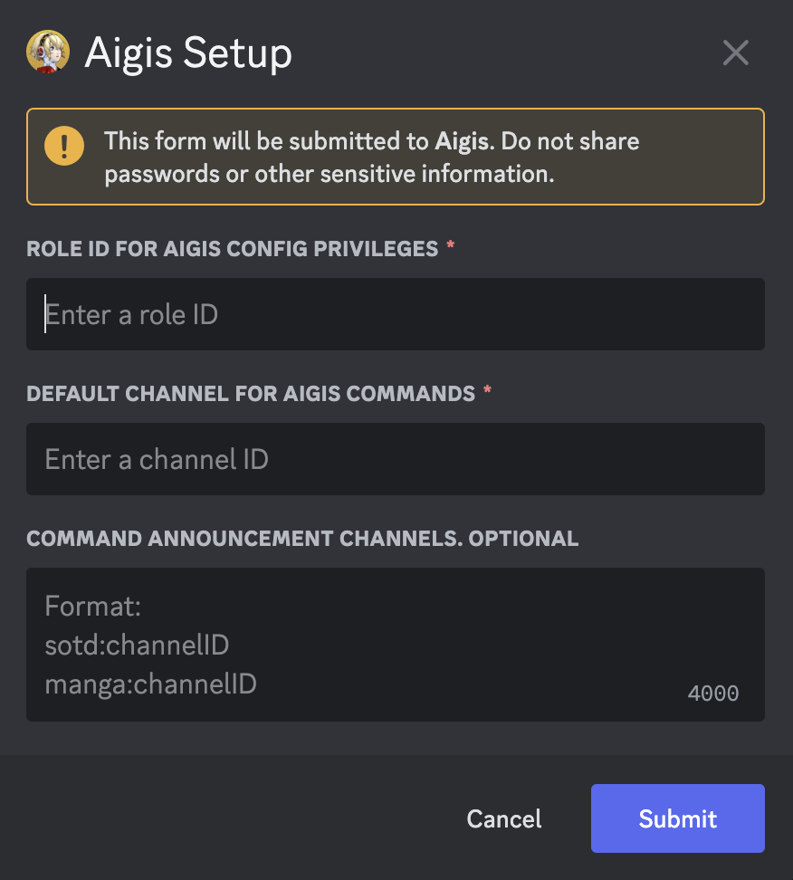
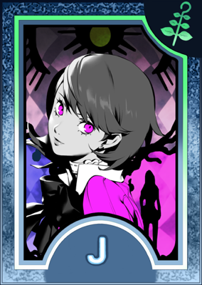
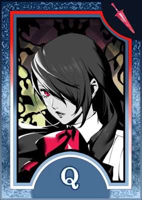

<!-- omit in toc -->
# Aigis
A multi-purpose Discord bot I made for fun because I like programming and I like Persona. She just does a bunch of silly things I thought would be neat to implement and perhaps useful too. And yes, Aigis will address you with the "-san" honorific.
 
 
You can join [the "official" Aigis Discord support server](https://discord.gg/CQyQYXBtca) for questions or feature requests. If you want to hang out and have more casual chats you can join [a different discord server](https://discord.com/invite/hpyeSZ4XCU) I am more active in. That is where I use Aigis' functionality.
 
 
Aigis is a [shape](https://wiki.shapes.inc/), and thus has AI functionality. To get more information about shapes, join the [Shapes.inc Discord server](https://discord.gg/shapes). To get more information about Aigis' specific AI configurations, check out the documentation for it [here](https://github.com/mdwelker10/discord-bot-aigis/blob/main/README-AI.md).
 
 
To get information on what data Aigis stores, and how to remove your server's data from her database, check out the documentation for the [purge command](https://github.com/mdwelker10/discord-bot-aigis/blob/main/README-Purge.md).

<!-- omit in toc -->
## Quick Links

- [Setup](#setup)
- [Enabling and Disabling Commands](#enabling-and-disabling-commands)
  - [Command Reference](#command-reference)
- [Basic Commands](#basic-commands)
- [Remindme Command](#remindme-command)
- [Song of the Day Command (SOTD)](#song-of-the-day-command-sotd)
  - [Playlist IDs](#playlist-ids)
  - [Command Reference](#command-reference-1)
- [Manga Command](#manga-command)
  - [Manga IDs](#manga-ids)
  - [ISO Language Standard](#iso-language-standard)
  - [Random Manga](#random-manga)
  - [Content Rating and 18+ Manga](#content-rating-and-18-manga)
  - [Supported Websites and Content Rating](#supported-websites-and-content-rating)
  - [Command Reference](#command-reference-2)
- [Currency: Velvet Tokens](#currency-velvet-tokens)
  - [Command Reference](#command-reference-3)
- [Blackjack](#blackjack)
  - [Logistics](#logistics)
  - [Command Reference](#command-reference-4)

## Setup

To invite Aigis to your server, use [this link](https://discord.com/oauth2/authorize?client_id=1241558106396168192&permissions=563364418149440&integration_type=0&scope=bot+applications.commands).

The first thing to do when Aigis joins would be to run the `/setup` command. This command helps configure Aigis' core features for the server. The person running `/setup` needs "manage server" permissions. If they can invite Aigis, they can run `/setup`.

To properly execute `/setup`, the person doing it should have [developer mode enabled to get channel and role IDs](https://support.discord.com/hc/en-us/articles/206346498-Where-can-I-find-my-User-Server-Message-ID)

The setup screen will have 3 input boxes.
1. **A role ID to allow a user to run privileged bot commands. There are not many of these at the moment.**
   - Being the server owner does not mean you are exempt from needing the role. The server owner should also have this role.
   - This does not include administrative commands like `setup` and `purge`. For those, the user needs "manage server" permissions. This role is used for Aigis' feature configuration.
   - To allow everyone in the server to run privileged bot commands, put "everyone" for the role ID.
   - This might be removed if it is decided that only separating "manage server" permissions from everyone else makes more sense.
2. **A default channel ID for Aigis to send messages in**
   - This does not force her to send all messages in this channel, but messages that are not responses to commands will automatically go there. This could be your dedicated bot channel other bots use.
3. **A list of commands with channel IDs for them to use**
   - Core features of Aigis might want to have their own dedicated channels, since they can be announcement-esque features. Think of this as being an override for the default channel ID for this specific command.
   - The format should be `<command>:<Channel ID>` with one per line.
   - This works for the `manga` and `sotd` (Song of the Day) commands.
   - If a command is not included, its channel will be set as the default channel you provided above.

These settings can all be changed later by running `/setup` again with the `force` option set to `True`. The pop up will only be valid for 90 seconds, so I suggest copying the IDs somewhere beforehand for easy access.

>Sometimes Aigis will respond twice when you run `/setup`, especially if you closed the pop-up and ran the command again. If you receive a successful response then you can ignore any error responses.

## Enabling and Disabling Commands
Aigis comes with the ability to customize which commands are enabled and disabled on your server. This was added due to the fact that Aigis is a [shape](https://wiki.shapes.inc/), and some people might only want her for that functionality. Others might only want the manga functionality, etc.
- This functionality is locked behind "manage server" permissions. 
- This command also requires that `/setup` has been run successfully.
- Administrative commands (this command, setup, purge) cannot be disabled.
- Subcommands cannot be individually disabled, so you cannot disable `/manga follow` while keeping `/manga random` enabled for example.
- All commands are enabled by default

To disable a command, run `/command disable <command-name>`, and to enable it again, run `/command enable <command-name>`. If you wish to enable/disable all commands, use `all` as the command name. If a command that has scheduled pings, such as `manga` or `remindme` is disabled, scheduled pings are not stopped. If you would like to stop the scheduled pings.
- The command name is what you would put after the forward slash when typing a command. Valid names include `manga`, `echo`, and `sotd` for example.
- If you would like to stop scheduled pings, you have 3 options:
  - Ask users to run commands such as `/sotd playlist remove` or `/manga unfollow` to get rid of any pings that would happen.
  - Start a data purge, which will stop all pings in 7 days and remove all data Aigis has saved about your server. This cannot be done with specific commands (cannot purge only manga information for example). After 7 days all data will be removed and the `/setup` command will need to be run again. For more information see the [purge command documentation](https://github.com/mdwelker10/discord-bot-aigis/blob/main/README-Purge.md).
  - Make a forum post on the support server with the `Data Deletion` tag describing why the two options above will not work, and I will manually remove the data. If this happens enough I will look into implementing command-based data deletion.

To see all Aigis commands, and whether they are enabled or disabled on your server, run `/command list`. This functionality and `/command help`, are not locked behind manage server permissions.
- Administrative commands are not shown on this list since they are always enabled.

### Command Reference
- `/command help` - Get more information on enabling/disabling commands, similar to the documentation.
- `/command list <datastore>` - Get a list of all non-admin Aigis commands. Optionally, set `datastore` to true to only list commands that store data.
- `/command enable <command-name>` - Enable an Aigis command on the server. Use command name "all" to enable all non-admin commands.
- `/command disable <command-name>` - Disable an Aigis command on the server. Use command name "all" to disable all non-admin commands.

## Basic Commands

Aigis has a few basic commands summarized below:
- `/echo <message>` - Repeats the message back to you
- `/ping` - Get Aigis' roundtrip latency
- `/user` - Get information about yourself

## Remindme Command

You can set reminders with Aigis using the `/remindme` command, and she will ping you when it is time. The reminder is set for a certain amount of time in the future, not at a specific date.
- The full syntax of the command is `/remindme <time> <message>`
- The valid units of time to set reminders for are days, hours, and minutes. There is no limitations on what numbers to use for these (you could set a reminder for 200 hours for example).

Some valid examples of `/remindme` are:
- `/remindme 1d Today is a new day`
- `/remindme 32d Today is a new month`
- `/remindme 7h30m Wake up Makoto-san`
- `/remindme 5d100m What a weird time interval`
- `/remindme 5m Hey <@365986896733536278>! Aigis can ping with reminders!`

## Song of the Day Command (SOTD)
One of Aigis' core features is that she can choose a "Song of the Day". This works by using Spotify's API to add playlists to select from. Aigis will shuffle through the playlists and select a random song from one each day at 12:00 AM EST.

The announcement for what song is chosen to be the Song of the Day will happen in the channel set using `sotd:<channel ID>` in the `/setup` command or the default bot channel if one is not specified. There is no `@everyone`, `@here`, or role ping for this, just a message.

There are a few restrictions on what playlists can be chosen:
1. The playlist **MUST** be a Spotify playlist, no other platforms are supported.
2. The playlist must be public.
3. The playlist must have at least 35 songs. This is to promote diversity in what songs are chosen. Aigis will not check for duplicate song entries though. If a playlist has 35 songs, is added, and then songs are removed to make it less than 35 songs, the playlist will be removed from rotation. 

**NOTE:** Adding and removing a playlist from the Song of the Day list are currently **privileged commands**. That is, only users with the role ID set in `/setup` can execute them. This is to prevent random people in the server from tampering with the rotation.
- These are currently the only privileged commands Aigis has

### Playlist IDs
To identify playlists, Spotify has an internal ID system. That is how playlists need to be referred to when using them in commands. To get a playlist's ID, copy the link as if you were going to share it. The link should be something like:

`https://open.spotify.com/playlist/1F0UF9B5AWMy6YzpQx34dV?si=279ffe2755f641e9`

In the above link, the playlist ID is `1F0UF9B5AWMy6YzpQx34dV`. The ID will always be after `playlist/` and before `?`.

### Command Reference
The following menu can be brought up by Aigis, along with the explanation of playlist IDs, via the `/sotd help` command.

- `/sotd add-playlist <playlist-id>` - Add a playlist to the list of playlists to select from for Song of the Day. Playlist must have at least 35 songs.
- `/sotd remove-playlist <playlist-id>` - Remove a playlist from the list of playlists to select from for Song of the Day.
- `/sotd list-playlists` - List all the playlists that are currently in the list of playlists to select from for Song of the Day.
- `/sotd select` - Manually select a song for Song of the Day. Used only for testing purposes and currently disabled on non-dev environments.
- `/sotd stop` - Stop the Song of the Day selection for all servers. Bot developer only.

## Manga Command
Aigis can also interact with various manga websites to retrive information about manga. This feature is mainly used to track manga releases and receive pings when a new chapter is uploaded.
- Aigis checks for updates once every hour. This could change in the future.
- Click [here](#supported-websites-and-content-rating) a list of supported Manga websites.

The announcement for manga chapter releases will happen in the channel set using `manga:<channel ID>` in the `/setup` command, or the default bot channel if one is not specified.

Since the manga command is implemented on a user basis instead of a server basis like Song of the Day, there are no privileged subcommands.

### Manga IDs
Similar to how Spotify uses playlist IDs to identify playlists, manga websites use manga IDs to identify manga. Getting the ID of a manga is different depending on the website, and some websites do not use IDs unique enough to differentiate them from other websites based on ID alone.

The `/manga idhelp` command should be the go-to documentation for how to retrive the ID of a manga for a website. If a website is not listed, then it is not supported. If you need futher clarification on getting the manga ID right, or need help, open an issue or message me on Discord.

If you would like to request a manga website to be supported, you can create an issue, message me on discord, or code it yourself and create a pull request (I need to set the repository up to allow pull requests from forks so if you code it for now just message me).

Instructions for adding a new manga are in [the main Manga command file](https://github.com/mdwelker10/discord-bot-aigis/blob/978d12fee44197e76a01ff09af9e67a50baec33c/commands/feature/manga.js), but most of the process is filling out the functions defined in the [Manga Template file](https://github.com/mdwelker10/discord-bot-aigis/blob/main/command_helpers/manga/manga-template.js).

### ISO Language Standard
When following a manga, you can specify what language you want to follow the manga in using the correlating [ISO 639 language code](https://en.wikipedia.org/wiki/List_of_ISO_639_language_codes). The language parameter is optional and will default to English if not included. Note that there is no check to determine if any chapter releases contain the specified language (or if there are even any chapter releases at all for that matter).

This feature is not available for every manga website. If you follow a manga on a website that does not support language variants, then the language parameter is ignored even if you provide it. The websites below support language variants:
- Mangadex

It is worth mentioning that Mangadex has some codes not defined by the standard that can be found [here](https://api.mangadex.org/docs/3-enumerations/). These are mostly language variants (like Latin-American Spanish) or Romanized languages (like Romanized Japanese).

### Random Manga
Unrelated to the following of manga, Aigis can also grab a random manga from Mangadex. This can be a fun way to pass time seeing the different kinds of manga and stories there are. Pornographic manga will *not* be chosen. The syntax of the random manga command is:

`/manga random <tag> <tag> <tag>`

The command can take up to 3 tags. The list of valid tags can be found [here](https://mangadex.org/tag/). There is also autocomplete functionality when typing in a tag name. 

The tags are used with **OR logic**. This means if you use 2 tags the chosen manga is guaranteed to have at least one of them, but not both. Although it is possible it will have both.

Aigis will attempt to display the title and description in English, but if English is unavailable she will either display it in the manga's native language or just say the title/description is unavailable.

### Content Rating and 18+ Manga
The following message can be brought up by Aigis by using the `/manga ratinghelp` command. For the SparkNotes version, here are some bullet points:
- To comply with Discord TOS, if you wish to follow pornographic manga, the channel that announces chapter releases must be marked as "age restricted".
- If I am unable to programatically determine a manga's content rating on a website, all mangas from that website are assumed to be pornographic.
- Erotica and suggestive manga is not impacted by this.
- For an idea of what manga falls under this rule, I am essentailly using Mangadex's rating system.
- If the channel was age restricted, and loses that status, you will still get chapter release pings but the link and manga title will not be sent. Instead you will essentially be told "A manga you are following has released chapter X".
- After this message is a list of the supported Manga websites and whether the content rating can be determined programatically.

**The full message and details:**

To comply with Discord's Terms of Service, manga with age restricted content can only be followed if the manga release channel is marked as age restricted. This channel is where manga chapter pings will occur, and is determined during the /setup command. If one is not provided, the default bot channel is used.

If the channel was marked as age restricted when you followed an 18+ manga and later lost it's age restricted status, you will receive a ping notifying you of this during the next chapter release. Due to how manga IDs are collected and the possibility of a NSFW title, the manga itself will not be specified and no links to chapters or the manga will be shared. However, the chapter number will be shown. If this happens, pings notifying you of chapter releases will continue unless you unfollow the manga, but the manga itself will not be specified. If a moderator marks the channel as age restricted again, pings will resume as normal.

For the purpose of this command, age restricted manga is defined as a manga featuring pornographic material, such as uncensored nudity/sexual content. In general, Mangadex's rating system can be applied. Manga with suggestive or erotica content will not be restricted as this is more akin to PG-13 content, and Discord requires users to be 13 years old to use the platform. Also, some websites do not provide a way to programatically determine the content rating of a manga. If this is the case, and the website actually serves explicit manga, then all manga will be assumed to be NSFW, and the rules above will apply even if the manga itself is not explicit.

### Supported Websites and Content Rating
Here is a full list of the supported websites and whether their content rating can be programatically determined.
- [Mangadex](https://mangadex.org/) - Content rating can be determined
- [Mangapill](https://mangapill.com/) - Content rating cannot be determined, but does not host manga that would need to be age restricted.
- [Mangakakalot](https://mangakakalot.com/) - Content rating cannot be determined. All manga marked as age restricted.
- [Manganato](https://manganato.com/) - Content rating cannot be determined. All manga marked as age restricted.

### Command Reference
The following menu can be brought up by Aigis, along with the explanation of the command basics and language codes, via the `/manga help` command.

- `/manga idhelp` - The command that documents what to use for a manga's ID for each supported website.
- `/manga ratinghelp` - The command that gives an outlines of how manga content rating is handled.
- `/manga follow <manga-id> <language>` - Follow a manga to get pinged for new chapter releases.
- `/manga list` - List all manga you are following.
- `/manga unfollow <manga-id> <language>` - Unfollow a manga to stop getting pinged for new chapter releases.
- `/manga random <tag-1> <tag-2> <tag-3>` - Get a random manga from Mangadex with at least one of the given tags.
- `/manga stop` - Stop manga chapter release checks for all servers. Bot developer only. 

## Currency: Velvet Tokens
Aigis keeps track of a fake currency known as `Velvet Tokens` or VT. This currency cannot be actually exchanged for anything (as of now), but can be used to play games. Below is the list of games that use VT as a form of currency.
- Blackjack
- Slots (Coming soon...)

There are 3 primary ways to earn Velvet Tokens:
- Collect daily tokens with the `/claim` or `/vt daily` commands (they do the same thing).
- Recieve tokens from another server member via them using the `/vt give` command.
- Gambling.

As of now, the daily token amount is 100. For every 7 consecutive days you claim your daily tokens you receive a bonus equal to `3 * <streak>`, where `streak` is the number of consecutive days you have claimed daily tokens. The check to see if you have claimed your daily tokens happens every night at 12:00 AM EST.
  - When you claim daily tokens for the first time, you will get 1000 instead of 100, and you will get a bonus amount of tokens equal to the amount of days you have been in the server.

### Command Reference
A similar menu to the one below can be brought up with the `/vt info` command.

- `/vt info` - Show information about Velvet Tokens, similar to what is talked about in this document.
- `/vt balance` - Show how many Velvet Tokens you have. Also shows how many you have gained/lost from gambling games.
- `/vt leaderboard` - Show the 10 server members with the highest amount of VT.
- `/vt give <user> <amount>` - Give the specified amount of Velvet Tokens to another user. You cannot give Velvet Tokens to yourself, and you cannot steal Velvet Tokens from other members by using a negative amount.
- `/vt daily` - Collect your daily tokens. Resets daily at 12:00 AM EST.
- `/claim` - Alias for `/vt daily`

## Blackjack
With the addition of Velvet Tokens comes a method of gambling them away in Blackjack. If you are unfamiliar with Blackjack you can read the rules [here](https://bicyclecards.com/how-to-play/blackjack) or use Aigis' `/blackjack rules` command. For those familiar with Blackjack, here are a few notes about how this version differs from normal:
- 8 decks of cards are used.
- You can only split once in a turn.
- The insurance bet is always half your original bet.
- The dealer will stand on 17, but a hard mode exists allowing the dealer to hit on a soft 17. Hard mode does not pay more than normal mode.
- The minimum bet is 5 VT and the maximum bet is 1 billion VT.
  - If you have less than 5 VT you cannot play, but just wait until the next day and you can claim 100 free daily tokens.

Because this is Aigis form Persona 3, I decided to use Persona themed cards instead of a standard deck. The suits are the minor arcana from Persona 3 and 4 (cups, swords, wands, and coins). Face cards and Aces have members of SEES on them.
- I do plan to remake the Aces, but they will still feature Makoto
- Even though Blackjack has no Joker cards, I still made one for fun

### Logistics
Multiple Blackjack games can be started per server, but a user can only be in one Blackjack game at a time, even across servers. A game is only the player vs. the dealer, so there is no "table" where multiple people are playing the dealer like in a real casino (I tried doing that, it got way too complicated).

Obivously, you can still use Aigis' other commands while a game of Blackjack is happening, even if you are actively playing a game of Blackjack. 

To alleviate the spam that comes with playing a game of Blackjack, it might be a good idea to have dedicated channels or threads for games. I decided to not make the messages private since you are not playing against anybody, and it can be fun to have other server members spectate.

If Aigis crashes, has to restart, or has to shut down while you are playing a game, the game will immediately end and your bet will be returned to you.

If you time out on a turn you will automatically stand the round. Then you will be prompted if you want to continue playing at the end of the round. If you time out of that prompt then Aigis will end the game. If you time out and auto-stand 3 rounds in a row then Aigis will also end the game, but you would have to try to do this since you would first time out of the "continue playing" prompt.

There is an option after each round to change your bet. If you select this option, just type a valid integer between the min and max bet values in chat (the same channel Aigis prompted you in) and she will accept your new bet. Don't worry, only you can set your bet. By default your bet is the minimum.

### Command Reference
- `/blackjack help` - A short description of the Blackjack command with similar information as this document.
- `/blackjack rules` - An explanation of the rules of Blackjack.
- `/blackjack start <hard-mode> <time-limit>` - Start a new Blackjack game. Hard mode is false by default and will allow the dealer to hit on a soft 17. By default the time limit is 30 seconds and can be set to anything between 10 and 60 seconds.
- 